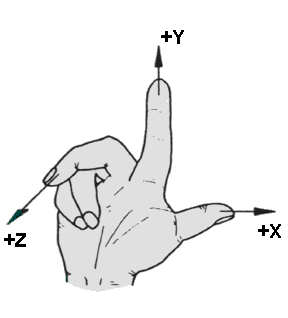
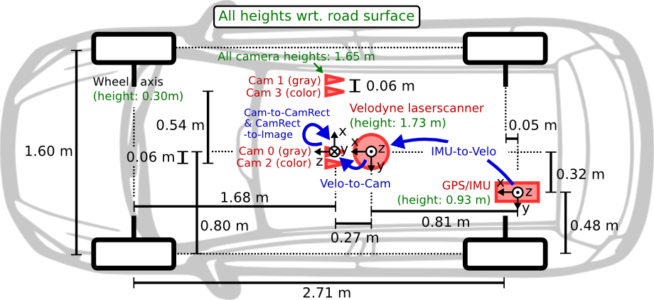
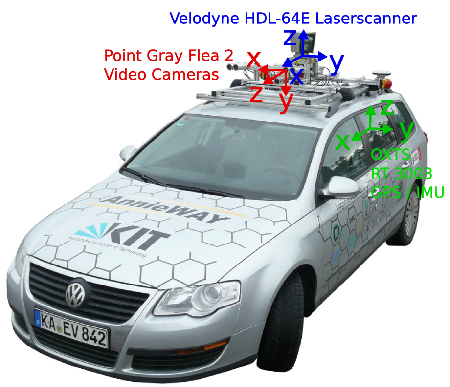
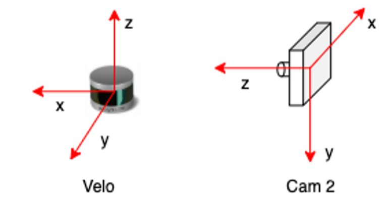

# Coordinate Metrology

- https://www.aukom.info/fileadmin/Webdata/el/english/elearning/03/raum.htm

Up to now, we have only looked at coordinate systems on the drawing plane, that is, in two-dimensional space. However, the reality is three-dimensional and so is the position of objects in space. Thus, every part, apart from its length and width, also has a height. Thus, in order to be able to specify a point on a part in space, in addition to the x and y coordinates, another one is needed: the z coordinate. The associated z axis is perpendicular to both the x axis and the y axis, as can be seen in the figure on the right.


To be able to determine the directions of the axes and the order of the x, y and z axes, the __right-hand rule__ is applied:

> Spread the first three fingers of your right hand, as seen on the right. By virtue of the right-hand rule, your thumb becomes the positive x axis, the index finger, which is at a right angle from the thumb, becomes the positive y axis and the middle finger becomes the z axis. The position of the middle finger is of decisive importance. It points in the positive z direction. No matter how you rotate your right hand, the positive direction of the z axis is determined by the right-hand rule.



- https://docs.panda3d.org/1.10/python/introduction/tutorial/loading-the-grassy-scenery

If you are used to OpenGL/Direct3D coordinates,
> then hold up your right hand in the classical position with thumb as X, fingers as Y, and palm as Z facing toward you; then tilt backward until your hand is level with the fingers pointing away and palm facing up. Moving “forward” in Panda3D is a positive change in Y coordinate.


## Check your understanding

* QUESTION 1 If the x-axis points upwards on the page, and the y-axis points to the right, the z-axis points:
  - A： out of the page
  - B： in to the page


* Question 2: Using the right-hand rule, your thumb corresponds to the:
  - A: x-axis
  - B: y-axis
  - C: z-axis

* Answer:
  - Question 1: B
  - Question 2: A


# KITTI Dataset
- https://github.com/lkk688/3DDepth/blob/main/README.md






The coordinate system of the following sensors:

* Camera: x = right, y = down, z = forward
* Velodyne: x = forward, y = left, z = up
* GPS/IMU: x = forward, y = left, z = up



Why do we need P?
> to properly relate world points to image points(by taking into account different coordinate systems)


# Waymo Dataset


# [MMDetection3D Coordinate System](https://mmdetection3d.readthedocs.io/en/v1.0.0rc1/tutorials/coord_sys_tutorial.html)

MMDetection3D uses three different coordinate systems. The existence of different coordinate systems in the society of 3D object detection is necessary, because for various 3D data collection devices, such as LiDAR, depth camera, etc., the coordinate systems are not consistent, and different 3D datasets also follow different data formats. Early works, such as SECOND, VoteNet, convert the raw data to another format, forming conventions that some later works also follow, making the conversion between coordinate systems even more complicated.

- Camera coordinate system – the coordinate system of most cameras, in which the positive direction of the y-axis points to the ground, the positive direction of the x-axis points to the right, and the positive direction of the z-axis points to the front.


- LiDAR coordinate system – the coordinate system of many LiDARs, in which the negative direction of the z-axis points to the ground, the positive direction of the x-axis points to the front, and the positive direction of the y-axis points to the left.

- Depth coordinate system – the coordinate system used by VoteNet, H3DNet, etc., in which the negative direction of the z-axis points to the ground, the positive direction of the x-axis points to the right, and the positive direction of the y-axis points to the front.


## Definition of the yaw angle

In object detection, we choose an axis as the gravity axis, and a reference direction on the plane perpendicular to the gravity axis, then the reference direction has a yaw angle of 0, and other directions on have non-zero yaw angles depending on its angle with the reference direction.

Currently, for all supported datasets, annotations do not include pitch angle and roll angle, which means we need only consider the yaw angle when predicting boxes and calculating overlap between boxes.

In MMDetection3D, all three coordinate systems are right-handed coordinate systems, which means the ascending direction of the yaw angle is counter-clockwise if viewed from the negative direction of the gravity axis (the axis is pointing at one’s eyes).

The figure below shows that, in this right-handed coordinate system, if we set the positive direction of the x-axis as a reference direction, then the positive direction of the y-axis has a yaw angle of PI/2.

```
                     z up  y front (yaw=0.5*pi)
                      ^    ^
                      |   /
                      |  /
                      | /
                      |/
left (yaw=pi)  ------ 0 ------> x right (yaw=0)
```

For a box, the value of its yaw angle equals its direction minus a reference direction. In all three coordinate systems in MMDetection3D, the reference direction is always the positive direction of the x-axis, while the direction of a box is defined to be parallel with the x-axis if its yaw angle is 0. The definition of the yaw angle of a box is illustrated in the figure below.
```
y front
  ^      box direction (yaw=0.5*pi)
 /|\        ^
  |        /|\
  |     ____|____
  |    |    |    |
  |    |    |    |
__|____|____|____|______\ x right
  |    |    |    |      /
  |    |    |    |
  |    |____|____|
  |
```

## Relation with raw coordinate systems of supported datasets
- KITTI
  - https://github.com/open-mmlab/mmdetection3d/blob/v1.0.0.dev0/tools/data_converter/kitti_data_utils.py
  
- Waymo

- NuScenes

- Lyft


