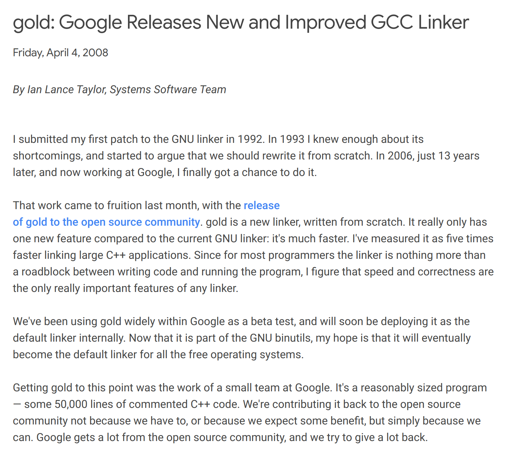

# Linker
What's the defference between: `-fpic` and `-fpie`?

from [gnu link options](https://gcc.gnu.org/onlinedocs/gcc/Link-Options.html), we we can know:
* default linker(internal linker)
  - https://github.com/bminor/binutils-gdb/tree/master/ld

* gold linker
  - https://github.com/bminor/binutils-gdb/tree/master/gold
  
  - The motivation for writing gold was to make a linker that is faster than the GNU linker,[3] especially for large applications coded in C++.
  
  - To specify gold in a makefile, one sets the `LD` or `LD` environment variable to `ld.gold`. To specify gold through a compiler option, one can use the gcc option `-fuse-ld=gold`.

  - [gold: Google Releases New and Improved GCC Linker](https://opensource.googleblog.com/2008/04/gold-google-releases-new-and-improved.html): 
  
  - `/usr/bin/gold` or `/usr/bin/ld.gold`

* bfd linker

* LLVM lld liner
  - https://lld.llvm.org/
  
  - LLD is a linker from the LLVM project that is a drop-in replacement for system linkers and runs much faster than them. It also provides features that are useful for toolchain developers.
  
  - LLD leaves its name and version number to a .comment section in an output. If you are in doubt whether you are successfully using LLD or not, run `readelf --string-dump .comment <output-file>` and examine the output.

* Modern Linker(mold)

```
$ gcc --help=common | grep use-ld
  -fuse-ld=bfd                Use the bfd linker instead of the default linker.
  -fuse-ld=gold               Use the gold linker instead of the default linker.
  -fuse-ld=lld                Use the lld LLVM linker instead of the default linker.
  -fuse-ld=mold               Use the Modern linker (MOLD) linker instead of the default linker.
```


- Check the default linker?
  - https://stackoverflow.com/questions/28688484/actual-default-linker-script-and-settings-gcc-uses

According to [collect2](https://gcc.gnu.org/onlinedocs/gccint/Collect2.html), "The program collect2 works by linking the program once and looking through the linker output file for symbols with particular names indicating they are constructor functions". So it's used to make linking possible.

```
$ strace -o forked.log -s 1024 -f -e trace=/exec gcc hello.c.s  -o hello_gcc

$ grep 'ld' forked.log 
2153  execve("/usr/libexec/gcc/x86_64-redhat-linux/4.8.5/collect2", ["/usr/libexec/gcc/x86_64-redhat-linux/4.8.5/collect2", "--build-id", "--no-add-needed", "--eh-frame-hdr", "--hash-style=gnu", "-m", "elf_x86_64", "-dynamic-linker", "/lib64/ld-linux-x86-64.so.2", "-o", "hello_gcc", "/usr/lib/gcc/x86_64-redhat-linux/4.8.5/../../../../lib64/crt1.o", "/usr/lib/gcc/x86_64-redhat-linux/4.8.5/../../../../lib64/crti.o", "/usr/lib/gcc/x86_64-redhat-linux/4.8.5/crtbegin.o", "-L/usr/lib/gcc/x86_64-redhat-linux/4.8.5", "-L/usr/lib/gcc/x86_64-redhat-linux/4.8.5/../../../../lib64", "-L/lib/../lib64", "-L/usr/lib/../lib64", "-L/usr/lib/gcc/x86_64-redhat-linux/4.8.5/../../..", "/tmp/ccyl36jf.o", "-lgcc", "--as-needed", "-lgcc_s", "--no-as-needed", "-lc", "-lgcc", "--as-needed", "-lgcc_s", "--no-as-needed", "/usr/lib/gcc/x86_64-redhat-linux/4.8.5/crtend.o", "/usr/lib/gcc/x86_64-redhat-linux/4.8.5/../../../../lib64/crtn.o"], 0x17b9da0 /* 61 vars */) = 0
2154  execve("/usr/bin/ld", ["/usr/bin/ld", "--build-id", "--no-add-needed", "--eh-frame-hdr", "--hash-style=gnu", "-m", "elf_x86_64", "-dynamic-linker", "/lib64/ld-linux-x86-64.so.2", "-o", "hello_gcc", "/usr/lib/gcc/x86_64-redhat-linux/4.8.5/../../../../lib64/crt1.o", "/usr/lib/gcc/x86_64-redhat-linux/4.8.5/../../../../lib64/crti.o", "/usr/lib/gcc/x86_64-redhat-linux/4.8.5/crtbegin.o", "-L/usr/lib/gcc/x86_64-redhat-linux/4.8.5", "-L/usr/lib/gcc/x86_64-redhat-linux/4.8.5/../../../../lib64", "-L/lib/../lib64", "-L/usr/lib/../lib64", "-L/usr/lib/gcc/x86_64-redhat-linux/4.8.5/../../..", "/tmp/ccyl36jf.o", "-lgcc", "--as-needed", "-lgcc_s", "--no-as-needed", "-lc", "-lgcc", "--as-needed", "-lgcc_s", "--no-as-needed", "/usr/lib/gcc/x86_64-redhat-linux/4.8.5/crtend.o", "/usr/lib/gcc/x86_64-redhat-linux/4.8.5/../../../../lib64/crtn.o"], 0x7fff14226a98 /* 61 vars */) = 0
```

- ` gcc -static -o empty empty.c -Wl,--verbose`

- `readelf -W -l empty`

- `$ gcc -Wl,-verbose`

- `$ ld --verbose`

## [Mold: A Modern Linker](https://github.com/rui314/mold)
For details, please see the [design notes](https://github.com/rui314/mold/blob/main/docs/design.md).

- For GCC 12.1.0 or later: pass `-fuse-ld=mold`

- For Clang: pass `-fuse-ld=mold`

- CMake
```
SET(CMAKE_CXX_FLAGS "${CMAKE_CXX_FLAGS} -fuse-ld=lld")
```

- Verify:
```
$ readelf -p .comment ./build/modules/basis/myio/test_io

String dump of section '.comment':
  [     0]  GCC: (Ubuntu 11.4.0-1ubuntu1~22.04) 11.4.0
  [    2c]  Linker: Ubuntu LLD 14.0.0 # because we set -fuse-ld=lld
```

### Details
- [Intel Threading Building Blocks (TBB)](https://github.com/oneapi-src/oneTBB) is a good library for parallel execution and has several concurrent containers. We are particularly interested in using parallel_for_each and concurrent_hash_map.

- TBB provides tbbmalloc which works better for multi-threaded applications than the glib'c malloc, but it looks like [jemalloc](https://github.com/jemalloc/jemalloc) and [mimalloc](https://github.com/microsoft/mimalloc) are a little bit more scalable than tbbmalloc.


* [musl](https://git.musl-libc.org/cgit/musl/): musl - an implementation of the standard library for Linux-based systems


## [Replacing ld with gold - any experience?](https://stackoverflow.com/questions/3476093/replacing-ld-with-gold-any-experience/53921263#53921263)

- LLD benchmarks

At https://lld.llvm.org/ they give build times for a few well known projects. with similar results to my synthetic benchmarks. Project/linker versions are not given unfortunately. In their results:

  - `gold` was about 3x/4x faster than `LD`

  - `LLD` was 3x/4x faster than `gold`, so a greater speedup than in my synthetic benchmark


.cpp
static variable
static method
vs 
variable
method
