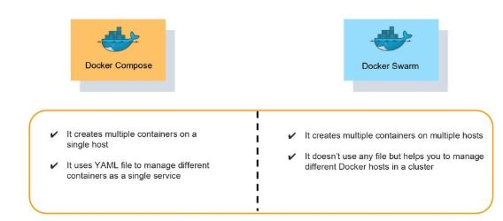

# Docker Compose

## What is Docker Compose?
Docker Compose is a tool that assists in defining and sharing multi-container applications. By using Compose, we can define the services in a YAML file, as well as spin them up and tear them down with one single command.


## Benefits of Docker Compose
- Single host deployment - This means you can run everything on a single piece of hardware
- Quick and easy configuration - Due to YAML scripts
- High productivity - Docker Compose reduces the time it takes to perform tasks
- Security - All the containers are isolated from each other, reducing the threat landscape

Now, you might be thinking that Docker Compose is quite similar to Docker Swarm, but that’s not the case. Here are some of the differences between Docker Compose and Docker Swarm:


## Basic Commands in Docker Compose
- Start all services: Docker Compose up
- Stop all services: Docker Compose down
- Install Docker Compose using pip: pip install -U Docker-compose
- Check the version of Docker Compose: Docker-compose-v
- Run Docker Compose file: Docker-compose up -d
- List the entire process: Docker ps
- Scale a service - Docker Compose up -d -scale
- Use YAML files to configure application services - Docker Compose.yml

## Installation
- Install Docker Compose on macOS 
For using Docker Compose on macOS, we need to just have Docker Desktop for Mac installed and don’t need to install Docker Compose separately.

- Install Docker Compose on Linux

$ docker-compose --version

## Create the Compose file
The next step is to create the Compose file for Docker Compose. 

Follow the below steps to create this file -

Create a file called docker-compose.yml at the root of the project.
We then proceed by defining and mentioning the version of the schema -
 `version: "<version number>"`

 To run as part of our application, we define the list of containers or services -
 ```
 version: "<version number>"

 services:
 ```

We then proceed to migrate a service one at a time to our already created Compose file.


## Define Various Services
To define the app container, we use the following command -

```
 docker run -dp 3000:3000 \
  -w /app -v "$(pwd):/app" \
  --network todo-app \
  -e MYSQL_HOST=<host_name>\
  -e MYSQL_USER=root \
  -e MYSQL_PASSWORD=secret \
  -e MYSQL_DB=<db_name> \
  node:12-alpine \
  sh -c "yarn install && yarn run dev"

```


Now, follow the below steps to successfully define the various services in Docker Compose -

1. We need to define the image and service entry for the container. We need to pick a custom name for our service, which will become our network alias and will be useful in defining the MySQL service. 

```
 version: "4.2"
 services:
   app:
     image: node:12-alpine
```

2. Close to the image definition, one can see the command. Now, we move this into our file. 

Note: There is no need for ordering.

```
 version: "4.2"
 services:
   app:
     image: node:12-alpine
     command: sh -c "yarn install && yarn run dev"
```
3. We define the ports for the service to migrate the `-p 3000:3000` part of the command. For the same reason, we will be using a short syntax here.
```
 version: "4.2"
 services:
   app:
     image: node:12-alpine
     command: sh -c "yarn install && yarn run dev"
     ports:
       - 3000:3000
```
4. Now, we migrate the volume mapping (-v "$(pwd):/app") and a working directory (-w /app) by using the definitions of volumes and working_dir. The volumes also have both short and long syntax.

Note: The advantage of the volume definitions in Docker Compose is that from the current directory, we can use relative paths. 
```
 version: "4.2"
 services:
   app:
     image: node:12-alpine
     command: sh -c "yarn install && yarn run dev"
     ports:
       - 3000:3000
     working_dir: /app
     volumes:
       - ./:/app
```

5. Using the environment key, we need to migrate the environment variable definitions.
```
 version: "4.2"
 services:
   app:
     image: node:12-alpine
     command: sh -c "yarn install && yarn run dev"
     ports:
       - 3000:3000
     working_dir: /app
     volumes:
       - ./:/app
     environment:
       MYSQL_HOST: mysql
       MYSQL_USER: root
       MYSQL_PASSWORD: secret
       MYSQL_DB: <db_name>
```

# Another example

What is docker-compose?
Let's come back to docker-compose.

Docker Compose is a tool you can use to define and share multi-container applications. This means you can run a project with multiple containers using a single source.

For example, assume you're building a project with NodeJS and MongoDB together. You can create a single image that starts both containers as a service – you don't need to start each separately.

Interesting right? And this solves the problem which I called out at the very beginning of this article.

To achieve this we need to define a docker-compose.yml.


version: '3'
services:
  app:
    image: node:latest
    container_name: app_main
    restart: always
    command: sh -c "yarn install && yarn start"
    ports:
      - 8000:8000
    working_dir: /app
    volumes:
      - ./:/app
    environment:
      MYSQL_HOST: localhost
      MYSQL_USER: root
      MYSQL_PASSWORD: 
      MYSQL_DB: test
  mongo:
    image: mongo
    container_name: app_mongo
    restart: always
    ports:
      - 27017:27017
    volumes:
      - ~/mongo:/data/db
volumes:
  mongodb:

Let's dismantle the above code and understand it piece by piece:

- version refers to the docker-compose version (Latest 3)
- services defines the services that we need to run
- app is a custom name for one of your containers
- image the image which we have to pull. Here we are using node:latest and mongo.
- container_name is the name for each container
- restart starts/restarts a service container
- port defines the custom port to run the container
- working_dir is the current working directory for the service container
- environment defines the environment variables, such as DB credentials, and so on.
- command is the command to run the service

# How to run the multi-container

- Build our multi-container using docker build
$ docker-compose build
app uses an image, skipping
mongo uses an image, skipping

- Run the containers using the `up` command after sucessfully building.

$ docker-compose up
Creating network "database_default" with the default driver
Creating volume "database_mongodb" with default driver
Pulling app (node:latest)...
latest: Pulling from library/node
8457fd5474e7: Pull complete
13baa2029dde: Pull complete
...

- use the `-d` flag if you wan to run the container in detached mode.

$ docker-compose up -d

- Check the container list

$ docker compose ps


- Stop it
$ docker-compose stop
Stopping app_mongo ... done
Stopping app_main  ... done


## Awsome-Compose
- https://github.com/docker/awesome-compose/blob/master/wordpress-mysql/compose.yaml
- https://github.com/itzg/docker-minecraft-server/blob/master/Dockerfile

- https://docs.docker.com/compose/gpu-support/
- https://stackoverflow.com/questions/29377853/how-can-i-use-environment-variables-in-docker-compose

