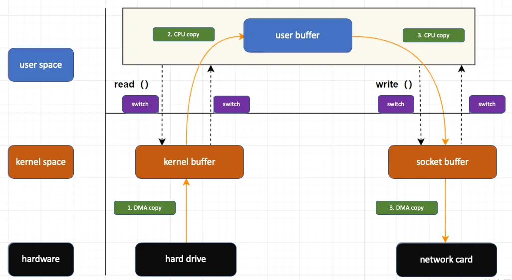

# Zero Copy

"Zero-copy" describes computer operations in which the CPU does not perform the task of copying data from one memory area to another or in which unnecessary data copies are avoided. This is frequently used to save CPU cycles and memory bandwidth in many time consuming tasks, such as when transmitting a file at high speed over a network, etc., thus improving the performance of programs (processes) executed by a computer.

- What is Zero Copy
  - “Zero”: Means that the number of times of copying data is 0.
  - “Copy”: Means that the data is transferred from one storage to another storage area.

- Execution Process of traditional IO

For example, if you want to implement a download function, the task of the server is to send the files in the server host disk from the connected socket. The key code is as follows:
```
while((n = read(diskfd, buf, BUF_SIZE)) > 0)
    write(sockfd, buf , n);
```
The traditional IO process includes read and write processes

  - read : read data from disk to kernel buffer, copy to user buffer
  - write : first write data to socket buffer, and finally write to network card device



- The application calls the read function, initiates an IO call to the operating system, and the context switches from user mode to kernel mode

- The DMA controller reads the data from disk to the kernel buffer

- The CPU reads the kernel buffer and copy data to application.


## Principle
Zero-copy programming techniques can be used when exchanging data within a user space process (i.e. between two or more threads, etc.) and/or between two or more processes (see also producer–consumer problem) and/or when data has to be accessed / copied / moved inside kernel space or between a user space process and kernel space portions of operating systems (OS).

Usually when a user space process has to execute system operations like reading or writing data from/to a device (i.e. a disk, a NIC, etc.) through their high level software interfaces or like moving data from one device to another, etc., it has to perform one or more system calls that are then executed in kernel space by the operating system.

If data has to be copied or moved from source to destination and both are located inside kernel space (i.e. two files, a file and a network card, etc.) then unnecessary data copies, from kernel space to user space and from user space to kernel space, can be avoided by using special (zero-copy) system calls, usually available in most recent versions of popular operating systems.

Zero-copy versions of operating system elements, such as device drivers, file systems, network protocol stacks, etc., greatly increase the performance of certain application programs (that become processes when executed) and more efficiently utilize system resources. Performance is enhanced by allowing the CPU to move on to other tasks while data copies / processing proceed in parallel in another part of the machine. Also, zero-copy operations reduce the number of time-consuming context switches between user space and kernel space. System resources are utilized more efficiently since using a sophisticated CPU to perform extensive data copy operations, which is a relatively simple task, is wasteful if other simpler system components can do the copying.

As an example, reading a file and then sending it over a network the traditional way requires 2 extra data copies (1 to read from kernel to user space + 1 to write from user to kernel space) and 4 context switches per read/write cycle. Those extra data copies use the CPU. Sending that file by using mmap of file data and a cycle of write calls, reduces the context switches to 2 per write call and avoids those previous 2 extra user data copies. Sending the same file via zero copy reduces the context switches to 2 per sendfile call and eliminates all CPU extra data copies (both in user and in kernel space).[1][2][3][4]

Zero-copy protocols are especially important for very high-speed networks in which the capacity of a network link approaches or exceeds the CPU's processing capacity. In such a case the CPU may spend nearly all of its time copying transferred data, and thus becomes a bottleneck which limits the communication rate to below the link's capacity. A rule of thumb used in the industry is that roughly one CPU clock cycle is needed to process one bit of incoming data.

## Hardware implementation

Techniques for creating zero-copy software include the use of direct memory access (DMA)-based copying and memory-mapping through a memory management unit (MMU). These features require specific hardware support and usually involve particular memory alignment requirements.

A newer approach used by the Heterogeneous System Architecture (HSA) facilitates the passing of pointers between the CPU and the GPU and also other processors. This requires a unified address space for the CPU and the GPU.


## 0. Zero Copy Data Access
Zero copy data access (ZCDA) is a technique that allows data to be transferred between applications without being copied from one memory location to another.
It can improve the performance of data-intensive applications by reducing the amount of time it takes to move data between different parts of the system.


ZCDA enables applications to access the memory location where the data is stored directly, saving time and improving performance.


## Linux tool: `cp` without Zero-copy

- Generating big data
```
$ dd if=/dev/urandom of=sendfile.in.tmp bs=1K count=10M
10485760+0 records in
10485760+0 records out
10737418240 bytes (11 GB, 10 GiB) copied, 44.8099 s, 240 MB/s
```

- time and strace
```
$ time cp sendfile.in.tmp sendfile.in.tmp0

read(3, "(7\7\273j1\321\35\373;P\264f\344\257\214+\31E\330\26\305\336'\224\37 ,\30\310~\313"..., 131072) = 131072
write(4, "(7\7\273j1\321\35\373;P\264f\344\257\214+\31E\330\26\305\336'\224\37 ,\30\310~\313"..., 131072) = 131072
read(3, "<\337\324\v\371\261]\315{\346\363\341&\317r\204\324\317\244\207\r\10\335\312YG\0160\332-\355\315"..., 131072) = 131072
write(4, "<\337\324\v\371\261]\315{\346\363\341&\317r\204\324\317\244\207\r\10\335\312YG\0160\332-\355\315"..., 131072) = 131072
read(3, "\327\30\333\310\347\337F\v\234\301\r\253\210\310\265\"\200#+\242\251\206\200`\247\0\nv\367\267(\327"..., 131072) = 131072
write(4, "\327\30\333\310\347\337F\v\234\301\r\253\210\310\265\"\200#+\242\251\206\200`\247\0\nv\367\267(\327"..., 131072) = 131072

real	0m10.987s
user	0m0.060s
sys	0m9.022s
```

- Re-implement a `cp` with `sendfile`

```
$ cat cp2.c 
#define _GNU_SOURCE
#include <assert.h>
#include <fcntl.h>
#include <stdlib.h>
#include <sys/sendfile.h>
#include <sys/stat.h>
#include <sys/types.h>
#include <unistd.h>

int main(int argc, char **argv) {
  char *source_path, *dest_path;
  int source, dest;
  struct stat stat_source;

  if (argc > 1) {
    source_path = argv[1];
  } else {
    source_path = "sendfile.in.tmp";
  }
  if (argc > 2) {
    dest_path = argv[2];
  } else {
    dest_path = "sendfile.out.tmp";
  }

  source = open(source_path, O_RDONLY);
  assert(source != -1);

  dest = open(dest_path, O_WRONLY | O_CREAT | O_TRUNC, S_IRUSR | S_IWUSR);
  assert(dest != -1);

  assert(fstat(source, &stat_source) != -1);
  // this copying is done within the kernel -- zero copy.
  assert(sendfile(dest, source, 0, stat_source.st_size) != -1);
  assert(close(source) != -1);
  assert(close(dest) != -1);
  
  return EXIT_SUCCESS;
}

$ time strace ./cp2 sendfile.in.tmp sendfile.in.tmp3
execve("./cp2", ["./cp2", "sendfile.in.tmp", "sendfile.in.tmp3"], 0x7fff3438a1c0 /* 81 vars */) = 0
brk(NULL)                               = 0x5582ad265000
arch_prctl(0x3001 /* ARCH_??? */, 0x7ffe399fb4e0) = -1 EINVAL (Invalid argument)
mmap(NULL, 8192, PROT_READ|PROT_WRITE, MAP_PRIVATE|MAP_ANONYMOUS, -1, 0) = 0x7f67499c1000
access("/etc/ld.so.preload", R_OK)      = -1 ENOENT (No such file or directory)
openat(AT_FDCWD, "/etc/ld.so.cache", O_RDONLY|O_CLOEXEC) = 3
newfstatat(3, "", {st_mode=S_IFREG|0644, st_size=117869, ...}, AT_EMPTY_PATH) = 0
mmap(NULL, 117869, PROT_READ, MAP_PRIVATE, 3, 0) = 0x7f67499a4000
close(3)                                = 0
openat(AT_FDCWD, "/lib/x86_64-linux-gnu/libc.so.6", O_RDONLY|O_CLOEXEC) = 3
read(3, "\177ELF\2\1\1\3\0\0\0\0\0\0\0\0\3\0>\0\1\0\0\0P\237\2\0\0\0\0\0"..., 832) = 832
pread64(3, "\6\0\0\0\4\0\0\0@\0\0\0\0\0\0\0@\0\0\0\0\0\0\0@\0\0\0\0\0\0\0"..., 784, 64) = 784
pread64(3, "\4\0\0\0 \0\0\0\5\0\0\0GNU\0\2\0\0\300\4\0\0\0\3\0\0\0\0\0\0\0"..., 48, 848) = 48
pread64(3, "\4\0\0\0\24\0\0\0\3\0\0\0GNU\0i8\235HZ\227\223\333\350s\360\352,\223\340."..., 68, 896) = 68
newfstatat(3, "", {st_mode=S_IFREG|0644, st_size=2216304, ...}, AT_EMPTY_PATH) = 0
pread64(3, "\6\0\0\0\4\0\0\0@\0\0\0\0\0\0\0@\0\0\0\0\0\0\0@\0\0\0\0\0\0\0"..., 784, 64) = 784
mmap(NULL, 2260560, PROT_READ, MAP_PRIVATE|MAP_DENYWRITE, 3, 0) = 0x7f674977c000
mmap(0x7f67497a4000, 1658880, PROT_READ|PROT_EXEC, MAP_PRIVATE|MAP_FIXED|MAP_DENYWRITE, 3, 0x28000) = 0x7f67497a4000
mmap(0x7f6749939000, 360448, PROT_READ, MAP_PRIVATE|MAP_FIXED|MAP_DENYWRITE, 3, 0x1bd000) = 0x7f6749939000
mmap(0x7f6749991000, 24576, PROT_READ|PROT_WRITE, MAP_PRIVATE|MAP_FIXED|MAP_DENYWRITE, 3, 0x214000) = 0x7f6749991000
mmap(0x7f6749997000, 52816, PROT_READ|PROT_WRITE, MAP_PRIVATE|MAP_FIXED|MAP_ANONYMOUS, -1, 0) = 0x7f6749997000
close(3)                                = 0
mmap(NULL, 12288, PROT_READ|PROT_WRITE, MAP_PRIVATE|MAP_ANONYMOUS, -1, 0) = 0x7f6749779000
arch_prctl(ARCH_SET_FS, 0x7f6749779740) = 0
set_tid_address(0x7f6749779a10)         = 131099
set_robust_list(0x7f6749779a20, 24)     = 0
rseq(0x7f674977a0e0, 0x20, 0, 0x53053053) = 0
mprotect(0x7f6749991000, 16384, PROT_READ) = 0
mprotect(0x5582abc38000, 4096, PROT_READ) = 0
mprotect(0x7f67499fb000, 8192, PROT_READ) = 0
prlimit64(0, RLIMIT_STACK, NULL, {rlim_cur=8192*1024, rlim_max=RLIM64_INFINITY}) = 0
munmap(0x7f67499a4000, 117869)          = 0
openat(AT_FDCWD, "sendfile.in.tmp", O_RDONLY) = 3
openat(AT_FDCWD, "sendfile.in.tmp3", O_WRONLY|O_CREAT|O_TRUNC, 0600) = 4
newfstatat(3, "", {st_mode=S_IFREG|0664, st_size=10737418240, ...}, AT_EMPTY_PATH) = 0
sendfile(4, 3, NULL, 10737418240)       = 2147479552
close(3)                                = 0
close(4)                                = 0
exit_group(0)                           = ?
+++ exited with 0 +++

real	0m1.217s
user	0m0.005s
sys	0m1.213s
```

## Refers
- `sendfile()` copies data between one file descriptor and another. Because this copying is done within the kernel, `sendfile()` is more efficient than the combination of read(2) and write(2), which would require transferring data to and from user space.

```
#include <sys/sendfile.h>

ssize_t sendfile(int out_fd, int in_fd, off_t *_Nullable offset, size_t count);
```

- [Apache Arrow](https://arrow.apache.org/)
  - Apache Arrow defines a language-independent columnar memory format for flat and hierarchical data, organized for efficient analytic operations on modern hardware like CPUs and GPUs. The Arrow memory format also supports zero-copy reads for lightning-fast data access without serialization overhead.

- 
