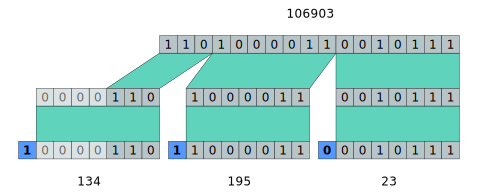

# [Variable-length quantity](https://en.wikipedia.org/wiki/Variable-length_quantity) 

A variable-length quantity (VLQ) is a universal code that uses an arbitrary number of binary octets (eight-bit bytes) to represent an arbitrarily large integer. A VLQ is essentially a base-128 representation of an unsigned integer with the addition of the eighth bit to mark continuation of bytes. VLQ is identical to LEB128 except in endianness. See the example below.

## Benefits
* Compactness: One of the primary benefits of VLQ encoding is its compactness. Since it uses a variable number of bytes to encode an integer, smaller integers can be represented using fewer bytes, resulting in a smaller overall file size. This is particularly useful in scenarios where storage space is at a premium, such as in embedded systems or mobile devices.
* Efficiency: VLQ encoding is an efficient way to store and transmit data. Since smaller integers are represented using fewer bytes, this reduces the amount of data that needs to be transmitted, which in turn reduces the time and bandwidth required to transmit the data.
* Flexibility: Another advantage of VLQ encoding is its flexibility. Since the number of bytes used to represent an integer is based on its magnitude, VLQ encoding can handle integers of different sizes. This means that VLQ encoding can be used to represent integers of any size, from small 8-bit integers to large 64-bit integers.
* Error detection: VLQ encoding also has built-in error detection capabilities. Since each byte in a VLQ-encoded integer has a specific format, errors caused by transmission or data corruption can be easily detected by checking the format of the encoded integer.


## Signed numbers
- Sign bit

Negative numbers can be handled using a sign bit, which only needs to be present in the first octet.


### Zigzag encoding
An alternative way to encode negative numbers is to use the least significant bit for sign.
This is notably done for Google Protocol Buffers, and is known as a zigzag encoding for signed integers.

One can encode the numbers so that encoded 0 corresponds to 0, 1 to −1, 10 to 1, 11 to −2, 100 to 2, etc.: counting up alternates between nonnegative (starting at 0) and negative (since each step changes the least-significant bit, hence the sign), whence the name "zigzag encoding". Concretely, transform the integer as __(n << 1) ^ (n >> k - 1)__ for fixed `k`-bit integers.
#### Example
- Google's varint: src/google/protobuf/wire_format_lite.h

Here is a worked-out example for the decimal number 137:

* Represent the value in binary notation (e.g. 137 as 10001001)
* Break it up in groups of 7 bits starting from the lowest significant bit (e.g. 137 as 0000001 0001001). This is equivalent to representing the number in base 128.
* Take the lowest 7 bits, and that gives you the least significant byte (0000 1001). This byte comes last.
* For all the other groups of 7 bits (in the example, this is 000 0001), set the MSb to 1 (which gives 1000 0001 in our example). Thus 137 becomes 1000 0001 0000 1001, where the bits in boldface are something we added. These added bits denote whether there is another byte to follow or not. Thus, by definition, the very last byte of a variable-length integer will have 0 as its MSb.


Diagram showing how to convert 106903 from decimal to uintvar representation

And
- https://neurocline.github.io/dev/2015/09/17/zig-zag-encoding.html

### Two's complement
LEB128 uses __two's complement__ to represent signed numbers. In this scheme of representation, n bits encode a range from −2n to 2n − 1, and all negative numbers start with a 1 in the most significant bit. In Signed LEB128, the input is sign-extended so that its length is a multiple of 7 bits. From there the encoding proceeds as usual.

In LEB128, the stream is arranged least significant first.

Free Standards Group (December 2005). "DWARF Debugging Information Format Specification Version 3.0" (PDF). p. 70. Retrieved 2009-07-19.
- https://dwarfstd.org/doc/Dwarf3.pdf


## Removing redundancy
The VLQ format used in Git removes this prepending redundancy and extends the representable range of shorter VLQs by adding an offset to VLQs of 2 or more octets in such a way that the lowest possible value for such an (N + 1)-octet VLQ becomes exactly one more than the maximum possible value for an N-octet VLQ. 

- [git](https://github.com/git/git/blob/7fb6aefd2aaffe66e614f7f7b83e5b7ab16d4806/varint.c#L4)
```c++
uintmax_t decode_varint(const unsigned char **bufp)
{
	const unsigned char *buf = *bufp;
	unsigned char c = *buf++;
	uintmax_t val = c & 127;
	while (c & 128) {
		val += 1;
		if (!val || MSB(val, 7))
			return 0; /* overflow */
		c = *buf++;
		val = (val << 7) + (c & 127);
	}
	*bufp = buf;
	return val;
}

int encode_varint(uintmax_t value, unsigned char *buf)
{
	unsigned char varint[16];
	unsigned pos = sizeof(varint) - 1;
	varint[pos] = value & 127;
	while (value >>= 7)
		varint[--pos] = 128 | (--value & 127);
	if (buf)
		memcpy(buf, varint + pos, sizeof(varint) - pos);
	return sizeof(varint) - pos;
}
```
